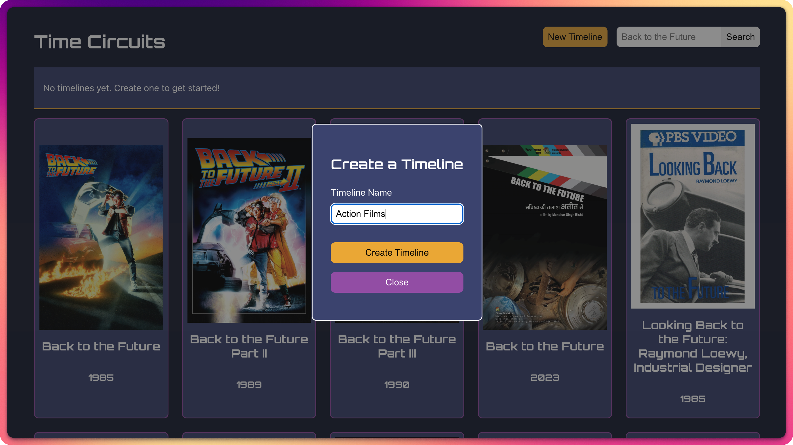
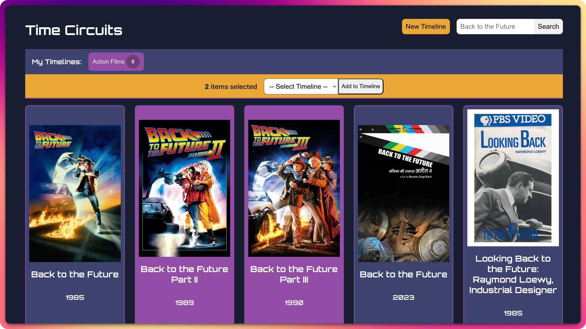
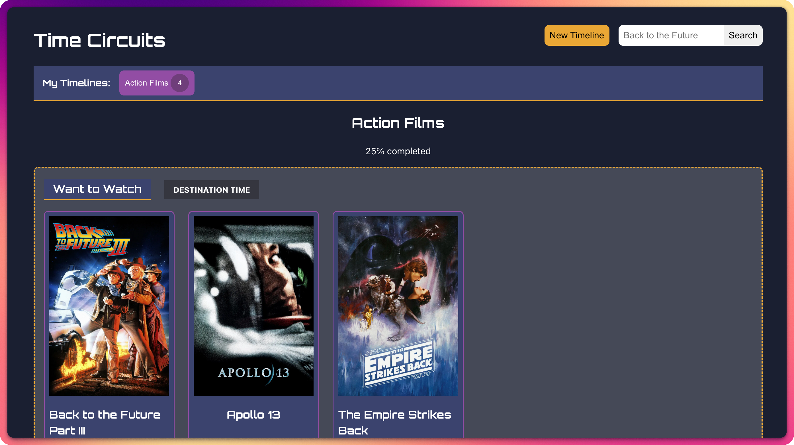
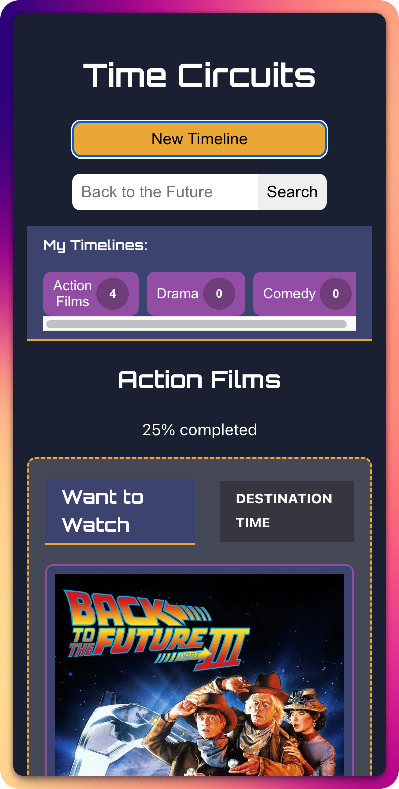

# ⚡️ Time Circuits

A React-based movie timeline organizer inspired by Back to the Future's time circuits. Create custom watchlists and track your movie-watching progress.

## ✨ Features

- **Custom Timelines** - Create and manage multiple movie collections
- **Movie Search** - Search movies using The Movie Database (TMDb) API
- **Status Tracking** - Organize movies by status: Want to Watch, Currently Watching, or Completed
- **Progress Visualization** - See your completion progress for each timeline
- **Batch Operations** - Select and add multiple movies at once

## 📸 Screenshots

<div style="display: flex; flex-wrap: wrap; justify-content: center">
  
  
  
  
</div>

## 🧰 Built With

- React 19 + Vite
- Netlify Functions (serverless API)
- TMDb API

## 🎬 Getting Started

```bash
# Install dependencies
npm install

# Run development server
npm run dev

# Or with Netlify Functions
npm run dev:netlify
```

Visit `http://localhost:5173` to start organizing your movies.
